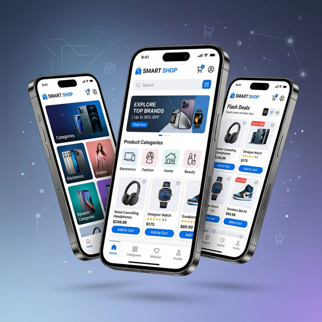

# 🛒 Smart Shop - Multi-Vendor E-Commerce System

<p align="center">
  
</p>

<p align="center">
  
  
  
  
</p>

---

## 🌟 Overview

**Smart Shop** is a premium, modern multi-vendor e-commerce platform built with **Flutter**. It's designed to provide a high-performance experience for Buyers, Sellers, and Admins. This project is a complete solution for anyone looking to launch a full-featured e-commerce mobile application.

## 🚀 Key Features

### 🛡️ Admin Dashboard
- **Attributes Management**: Full control over product variations (colors, sizes, etc.).
- **System Configuration**: Manage categories, dynamic notifications, and global settings.
- **User Insights**: Real-time tracking of marketplace activity.

### 🏪 Seller Portal
- **Shop Management**: Dedicated dashboard for sellers to manage their brand.
- **Easy Uploads**: Streamlined product listing process with multi-image support.
- **Customer Chat**: Real-time communication powered by **Firebase**.

### 🛍️ Customer App
- **High-Performance Search**: Find products instantly.
- **Wallet & Checkout**: Seamless payment and digital wallet integration.
- **Vouchers & Deals**: Boost sales with dynamic coupon systems.
- **Smart Notifications**: Stay updated with push notifications.

## 🛠️ Hybrid Architecture (Tech Stack)

This project uses a specialized **hybrid backend architecture** for maximum efficiency:

- **Primary Backend**: Professional REST API hosted on a custom domain (`codegeeks.easycode4u.com`) for core business logic.
- **Real-time Synchronization**: **Firebase (Firestore & Auth)** handling live chat and authentication.
- **Frontend**: **Flutter (GetX)** for a smooth, reactive user interface.
- **Local Storage**: GetStorage & Shared Preferences for offline-first capabilities.

## 📂 Project Structure

```text
lib/
├── core/         # ApiClient, Constants, Theme engine
├── data/         # Data Models & Repository Layer
├── modules/      # Feature-driven Architecture (Admin, Seller, Auth, etc.)
└── widgets/      # Reusable UI Atoms & Molecules
```

## 🏁 How to Use?

1.  **Clone the Repo**:
    ```bash
    git clone https://github.com/kg-awaisali/multiavander_system-.git
    ```
2.  **Dependencies**: `flutter pub get`
3.  **Run Application**: `flutter run`

---

## 📈 How to Support?
If you find this project helpful:
- ⭐ **Star this repository** to help others find it!
- 🍴 **Fork it** and build your own version.
- 📢 **Share it** on LinkedIn or Twitter.

---
*Developed with ❤️ by [Awais Ali](https://github.com/kg-awaisali)*
